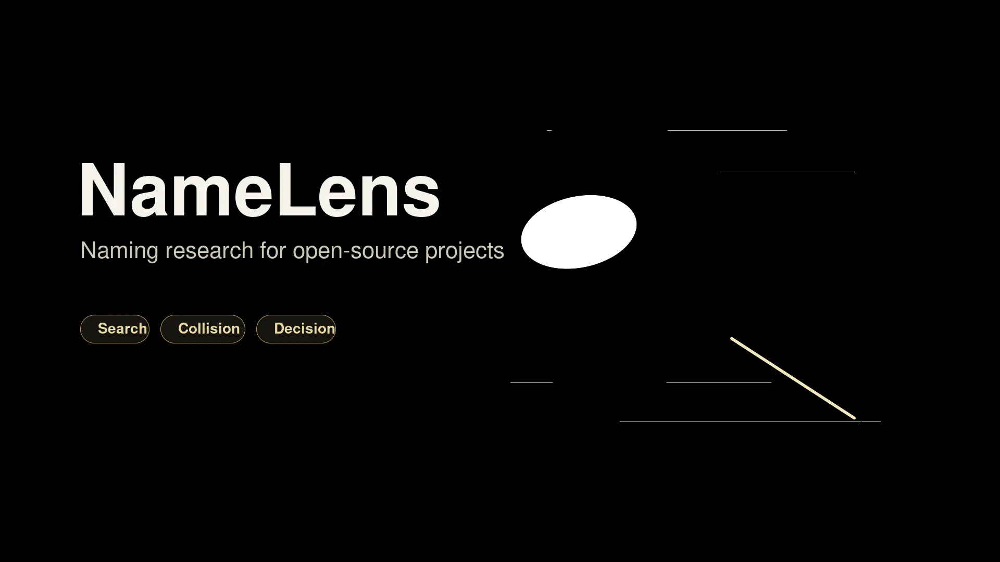

<div align="center">

# NameLens

**Research, stress-test, and name your next open-source project.**



[](./LICENSE)

</div>

---

NameLens is an Agent Skill for project naming research. It helps builders generate candidate names, check collisions across GitHub and package ecosystems, verify language claims, and choose one name that is memorable, searchable, and ready to publish.

## Why It Exists

Naming an open-source project is not only a creative task. A strong name has to survive search results, repository slugs, package registries, CLI commands, pronunciation, cross-language meaning, and future scope.

NameLens treats a name as a publishing decision, not a random suggestion.

## What It Checks

- **Positioning:** what the name should signal, who it serves, and what future scope it must leave open.
- **Transmission:** whether people can read, say, hear, spell, type, and remember it.
- **Collisions:** web search, GitHub, package registries, app stores, domains, handles, and realistic variants.
- **Language risk:** verified roots, native usage, romanization, pronunciation, slang, and false etymology.
- **SEO/GEO clarity:** a stable brand plus a clear category descriptor that machines and people can understand.
- **Decision quality:** ranked finalists, rejected names, trade-offs, and one recommended winner.

## Quick Start

Install the skill from this repository:

```bash
npx skills add geekjourneyx/namelens
```

Then ask your agent to use `namelens` for a naming decision:

```text
I am building a Rust CLI that finds visually similar screenshots.
Name it. The crate, command, and GitHub repo should match if possible.
Avoid cute names, verify collisions, and give me one final recommendation.
```

## Example Prompts

```text
Rename an open-source AI note-organizing tool.
The name should be easy to share, low-risk on GitHub and npm,
and should not rely on unverified Latin or Japanese etymology.
```

```text
Compare NameLens, NameRadar, and Nomexa for an Agent Skill that researches names
for open-source projects. I need one final recommendation and exact GitHub About text.
```

```text
I am building a consumer app for Japanese learners who practice shadowing from podcasts.
Explore English, Japanese, Latin, and metaphorical options, then screen obvious collisions.
```

## What You Get

A standard NameLens report includes:

1. A compact naming brief and assumptions.
2. Search scope and research date.
3. Independent naming lanes, not twenty variants of one root.
4. A candidate matrix with pronunciation, semantic fit, collision risk, namespace fit, and naming difficulty.
5. Top finalists with clear trade-offs.
6. Rejected or dangerous names and why they failed.
7. Launch-ready identity fields: display name, repository slug, package or command name, category descriptor, tagline, GitHub About text, topics, and remaining checks.

NameLens never presents preliminary research as legal or trademark clearance.

## Modes

| Mode | Use When | Output |
|---|---|---|
| Quick | Early exploration | 12-18 candidates, light collision checks, top 3 |
| Standard | Default naming decision | 30-50 raw candidates, 12-20 researched finalists, one winner |
| Deep | Public launch or commercial stakes | More variants, domains, handles, app stores, local markets, and preliminary trademark screening |

## Project Layout

```text
assets/
├── banner.svg
├── banner.png
└── banner.webp
SKILL.md
test-prompts.json
evals/
examples/
references/
```

The skill is pure documentation. There are no runtime scripts or package dependencies in this repository.

## License

[MIT](./LICENSE)

## Author

- Website: [jieni.ai](https://jieni.ai)
- GitHub: [@geekjourneyx](https://github.com/geekjourneyx)
- X: [@seekjourney](https://x.com/seekjourney)
- WeChat Official Account: 极客杰尼
